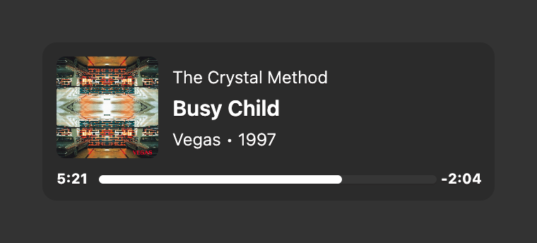

# Now Playing

A simple music widget for [Übersicht](http://tracesof.net/uebersicht). Based on the [Playbox](https://github.com/Pe8er/Playbox.widget) widget by [Pe8er](https://github.com/Pe8er). This widget shows the current playing song from either Apple Music or Spotify. It also shows the album artwork if it can find it and has a progress bar with elapsed/remaining time. When a track is loved/favorited in Apple Music, a small star appears next to the title.

## Screenshot



## Options

There are a few options you can change by editing the index.coffee file.

```coffeescript
  # Enable or disable the widget.
  widgetEnable : true                   # true | false

  # Choose where the widget should sit on your screen.
  verticalPosition    : "bottom"        # top | bottom | center
  horizontalPosition    : "left"        # left | right | center

  # Show the time labels next to the progress bar at all. When false the bar
  # fills the entire row and showRemainingTime/showBothTimes are ignored.
  showTime           : true             # true | false

  # Show time as -M:SS (remaining) instead of M:SS (elapsed).
  showRemainingTime  : false            # true | false

  # Show elapsed AND remaining on opposite sides of the bar (overrides the above).
  showBothTimes      : true             # true | false

  # Progress bar position.
  #   "expanded": full-width bar below album art + metadata (default).
  #   "compact":  bar tucked inside the track-info column, beneath the album/year line.
  progressBarPosition : "expanded"      # expanded | compact
```

## Installation

- Download the [repository](https://github.com/dionmunk/uebersicht-now-playing/archive/master.zip) and extract it.
- Place the `now-playing.widget` folder in your Übersicht extension folder.
- Refresh Übersicht.

## Notes

- Apple Music exposes the release year and loved/favorited status; Spotify's scripting API does not, so those are omitted for Spotify tracks.

## License

This work is licensed under a [Creative Commons Attribution-NonCommercial 4.0 International License](https://creativecommons.org/licenses/by-nc/4.0/).
